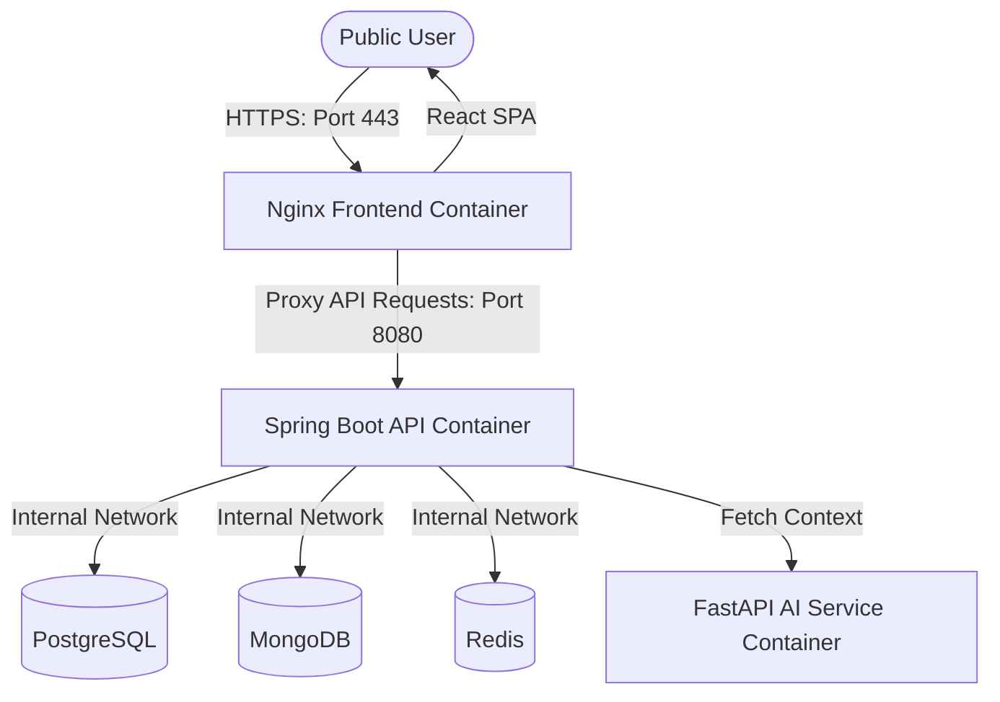

# TECHSETU AI OS — Live Public Deployment Guide

This guide details how to deploy the **TECHSETU AI OS** container stack onto a live, publicly accessible server (VPS) under your own custom domain name with SSL (HTTPS) security.

---

## 🗺️ Architectural Workflow

When deploying live, the layout functions as follows:



---

## 📋 Step 1: Provision a Server (VPS)

A Virtual Private Server (VPS) is the most robust and cost-effective way to host a multi-container Docker Compose stack.

### Recommended Providers:
1.  **DigitalOcean** (Basic Droplet: 2 CPU, 4GB RAM)
2.  **AWS** (EC2 Instance: `t3.medium`)
3.  **Hetzner / Hostinger** (VPS Plan 2 or 3)

*Operating System: Choose **Ubuntu 22.04 LTS** or **Ubuntu 24.04 LTS**.*

---

## 🌐 Step 2: Configure Your Domain Name

To make the platform accessible via a friendly URL (e.g., `ai-os.yourdomain.com`):
1.  Log in to your Domain Registrar (GoDaddy, Namecheap, Google Domains/Squarespace).
2.  Navigate to the **DNS Management** panel.
3.  Add an **A Record**:
    *   **Host**: `@` (for root domain) or `ai-os` (for subdomain).
    *   **Value**: Enter the public IP address of your newly provisioned VPS.
    *   **TTL**: `3600` (1 hour).

---

## 📥 Step 3: Install Docker on the Server

SSH into your server using your terminal:
```bash
ssh root@your_server_ip
```

Run the official Docker installation script:
```bash
# Update package database
sudo apt update && sudo apt upgrade -y

# Install Docker
curl -fsSL https://get.docker.com -o get-docker.sh
sudo sh get-docker.sh

# Verify installation
docker --version
docker compose version
```

---

## 📂 Step 4: Clone & Configure Env Vars

Clone your repository onto the server:
```bash
git clone <your-repository-url> /var/www/techsetu-ai-os
cd /var/www/techsetu-ai-os
```

Create a production `.env` file to store keys:
```properties
GEMINI_API_KEY=your_gemini_api_key_here
SPRING_DATASOURCE_PASSWORD=secure_postgres_password_here
APP_JWT_SECRET=secure_jwt_secret_key_32_bytes_long_here
```

---

## 🔒 Step 5: Configure SSL (HTTPS) with Certbot

To secure passwords, tokens, and chats, we configure **Nginx** and **Certbot (Let's Encrypt)** on the host server to route public `HTTPS (443)` traffic.

1.  **Install Nginx on the host server**:
    ```bash
    sudo apt install nginx -y
    ```
2.  **Configure Nginx reverse proxy**:
    Create a new site file: `/etc/nginx/sites-available/techsetu`
    ```nginx
    server {
        listen 80;
        server_name ai-os.yourdomain.com; # Your domain name

        location / {
            proxy_pass http://localhost; # Forward traffic to the Docker Frontend container (Port 80)
            proxy_set_header Host $host;
            proxy_set_header X-Real-IP $remote_addr;
            proxy_set_header X-Forwarded-For $proxy_add_x_forwarded_for;
            proxy_set_header X-Forwarded-Proto $scheme;
            
            # WebSockets support
            proxy_http_version 1.1;
            proxy_set_header Upgrade $http_upgrade;
            proxy_set_header Connection "Upgrade";
        }
    }
    ```
3.  **Enable the configuration**:
    ```bash
    sudo ln -s /etc/nginx/sites-available/techsetu /etc/nginx/sites-enabled/
    sudo systemctl restart nginx
    ```
4.  **Run Certbot to obtain SSL certificate**:
    ```bash
    sudo apt install certbot python3-certbot-nginx -y
    sudo certbot --nginx -d ai-os.yourdomain.com
    ```
    *Certbot will automatically verify ownership, download the SSL keys, and rewrite your Nginx configurations to redirect all `HTTP` requests to secure `HTTPS`!*

---

## 🚀 Step 6: Launch the App

Run the production Docker Compose command:
```bash
docker compose -f docker-compose.prod.yml up --build -d
```

Your **TECHSETU AI OS** is now officially live on the internet! Users can navigate to `https://ai-os.yourdomain.com` to log in, run agents, collaborate, and query RAG files securely.
